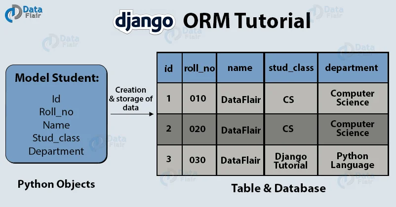
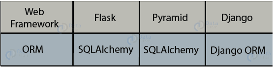
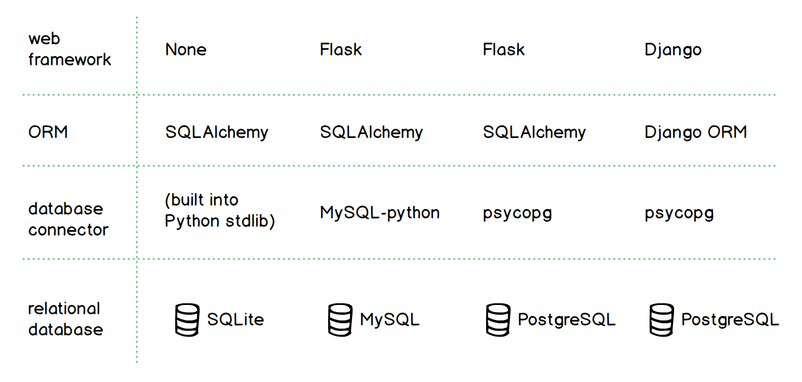
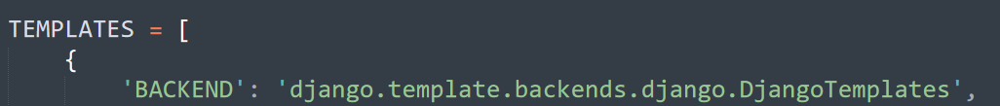
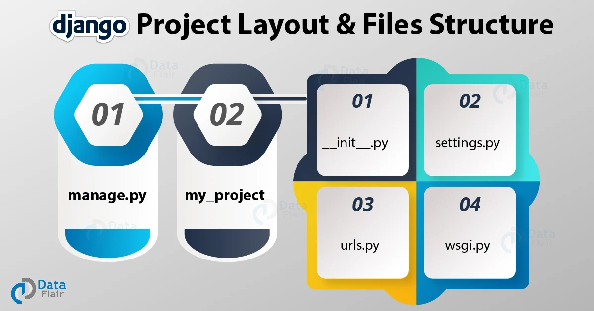
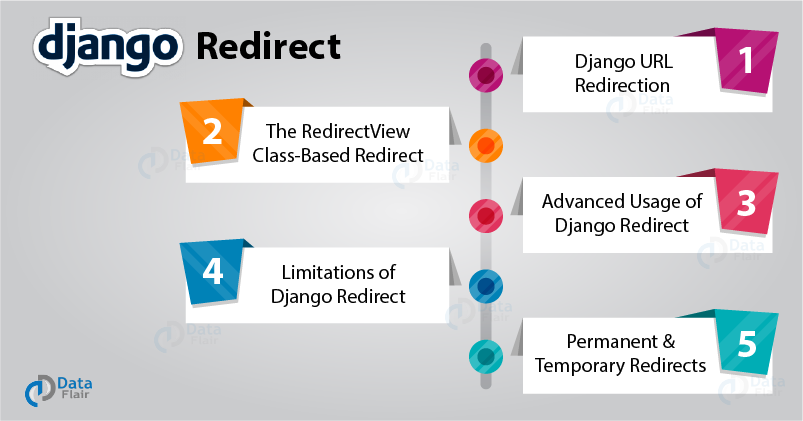

"# Django" 

**ORM** is an acronym for the object-relational mapper. The ORM’s main goal is to transmit data between a relational database and application model. The ORM automates this transmission, such that the developer need not write any SQL.

ORM, as from the name, maps objects attributes to respective table fields. It can also retrieve data in that manner.

In the above image, we have some Python objects and a table with corresponding fields. The object’s attributes are stored in corresponding fields automatically. An ORM will automatically create and store your object data in the database. You don’t have to write any SQL for the same.
ORMs automatically create a database schema from defined classes/ models. They generate SQL from Python code for a particular database. ORMs let the developer build the project in one language that means Python.

This increased the popularity of ORMs and web-frameworks. There are different ORMs available in the market but one of the best is Django ORM.

Not only ORMs, but there are also multiple Python Connectors for databases available. These ORMs use connectors to connect databases with a web application. you have to install the connector of a specific database you want to work with.

For more info: https://www.fullstackpython.com/object-relational-mappers-orms.html

A **Model** as stated in the definition is the link between the server and your database. Now, whenever you need the data or any operation is performed where data from the server is needed which is essentially just retrieving data from your database, it will need some middleware or bridge which can convert that data in a transmittable/Http response or more generally a web-transmittable format. 
Therefore, Model comes in and does this important work for you. Model not only retrieves the data and converts it into the desirable format but execute it by applying business logic, or the logical part/ backend of your website that is actually inside the model component.

**What are Django Templates?**
Django templates are a combination of static HTML layout and Django Syntax which is essentially Python code. Both of these components help in generating HTML pages dynamically and make your website more user-engaging.
The main purpose of Django templates is to separate the data representation with the data itself. That means, the browser part is only to render the HTML sent to it by the server, and all the relevant data is given to the template by Django itself. This makes the process much easier and pages render easily as there is less clutter in both the front-end and back-end.
Django templating is done via templating engines, there are multiple templating engines(Jinja templating) although the one which Django ships in is Django template as you can see in your projects’ settings.py file.

Django templates use special language or syntax to implement it because essentially Django template is nothing but python string, which marks-up by Django Template Engine.

There are 4 types of syntax in Django Template language:

**i. Tags/ **

Whenever we use , inside a Django Template, we are writing some logic code that will implement on the data we just passed with the render.
These are called tags in Django Templates.

In the first template,
``
We started a for loop which will run until the end of our database records. Then it will repeat the statements above the ``. The statements between them can be any segment, either Python or browser readable (HTML, CSS, JavaScript), etc.

**ii. Printing Value/ {{ variables }}**

Whenever we want to print output of Python code in a Django template directly from the server, we use:

`{{variable/ model to print}}`

We will use these statements in most of your browser-renderable code, as this piece here will exchange with the actual value of the variable stored in it by the server.

**iii. Filters / {{ metadata | response }}**

Since Django is a web framework, it will also serve content on the basis of metadata, where we use the filters.

`{{ metadata| response or render }}`

We need these filters mostly when working on a very big project, where the metadata for the site matters, otherwise it is not that important for smaller blog websites.
Although, by using it for metadata, Django also provides us to dynamically generate our metadata.

**iv. Comments/ {# Comments #}**

Comments are the best practices that increase code usability, and readability. Therefore, Django framework provides you with this special tag to comment in the template language.

The general syntax is:

`{# this will not be rendered by the browser #}`

**_We completed 3 main fundamentals of web development and Django._**

_**As we learned that,**_

_**1. Models are for the data transmission between the database and view, they contain data definition of our website.**_

**_2. View are the connectors between the models and templates while also passing the required server data. They contain the business logic._**

_**3. Templates play an important role in Django and are presently the best implementation of loosely coupled architectures.**_

**1. manage.py**
This file is the command line utility of the project, and we will be using this file only to deploy, debug and test with the project.

The file contains the code for starting the server, migrating and controlling the project through command-line.
This file provides all the functionality as with the django-admin, and, it also provides some project specific functionalities. During this tutorial, we will frequently use some commands that are runserver, makemigrations, migrate etc. We will be using these commands more frequently than others.

**_runserver_** is a command to start the test server provided by Django framework and that is also one of the advantages of Django over other frameworks.

**_makemigrations_** is the command for integrating your project with files or apps you have added in it. This command will actually check for any new additions in your project and then add that to the same.

_**migrate**_, the last command is to actually add those migrations you made in the last command with the whole project. You can get the idea as the former command is used for saving the changes in the file and later one to actually apply that change to the whole project then the single file.

**_ i __init__.py_**
The __init__.py file is empty, and it exists in the project for the sole purpose of telling the python interpreter that this directory is a package. That’s one of the standard rules of python packages.

**_ii. settings.py_**
The settings.py is the main file where we will be adding all our applications and middleware applications. As the name suggests this is the main settings file of the Django project. This file contains the installed applications and middleware information which are installed on this Django project.
Every time you install a new app or custom application you will be adding that in this file.

**Redirect**

`$ curl --include http://127.0.0.1:8000/hello/
HTTP/1.1 200 OK
Date: Sun, 01 Jul 2018 20:32:55 GMT
Server: WSGIServer/0.2 CPython/3.6.3
Content-Type: text/html; charset=utf-8
X-Frame-Options: SAMEORIGIN
Content-Length: 11
Hello World
`
As you can see, an HTTP response starts with a status line that contains a status code and a status message. The status line is followed by an arbitrary number of HTTP headers. An empty line indicates the end of the headers and the start of the response body, which contains the actual data the server wants to send.

**_HTTP Redirects Status Codes_**

What does a redirect response look like? Let’s assume the path /redirect/ is handled by redirect_view(), shown earlier. If you access http://127.0.0.1:8000/redirect/ with curl, your console looks like this:

`$ curl --include http://127.0.0.1:8000/redirect/
HTTP/1.1 302 Found
Date: Sun, 01 Jul 2018 20:35:34 GMT
Server: WSGIServer/0.2 CPython/3.6.3
Content-Type: text/html; charset=utf-8
Location: /redirect-success/
X-Frame-Options: SAMEORIGIN
Content-Length: 0
`The two responses might look similar, but there are some key differences. The redirect:

Returns a different status code (302 versus 200)
Contains a Location header with a relative URL
Ends with an empty line because the body of the redirect response is empty

In other words, whenever the server sends a status code of 302, it says to the client, “Hey, at the moment, the thing you are looking for can be found at this other location.”

A key phrase in the specification is “MAY use the Location field value for automatic redirection.” It means that you can’t force the client to load another URL. The client can choose to wait for user confirmation or decide not to load the URL at all. 

Now you know that a redirect is just an HTTP response with a 3xx status code and a Location header. The key takeaway here is that an HTTP redirect is like any old HTTP response, but with an empty body, 3xx status code, and a Location header.

That’s it. We’ll tie this back into Django momentarily, but first let’s take a look at two types of redirects in that 3xx status code range and see why they matter when it comes to web development.
